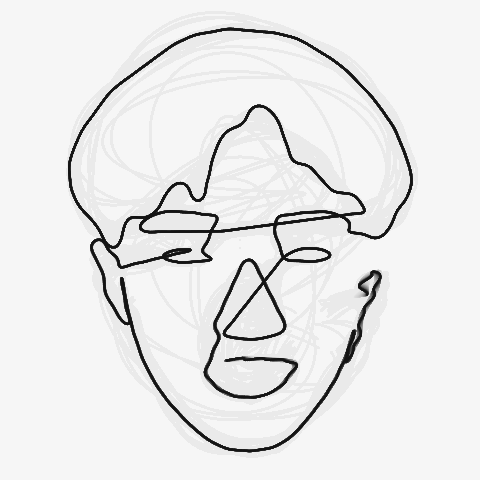

# Bio Glyph

Bio Glyph is a web application that creates a one-line drawing of your face. It explores the idea of using facial features as a personal signature and rethinking identity through generative art. Using MediaPipe and image-processing techniques, the system detects different parts of the face — including the eyes, nose, lips, and facial contours — and connects them into a continuous line. To make the generation process more engaging, Bio Glyph applies Fourier series transformations to progressively reconstruct the drawing over time, inspired by [Mike Bostock](https://bost.ocks.org/mike/)'s [Fourier Series - Progressive](https://observablehq.com/@mbostock/fourier-series-progressive). The application also allows users to replay the animation, watching their face gradually emerge from nothingness, creating a sense of formation and becoming.
