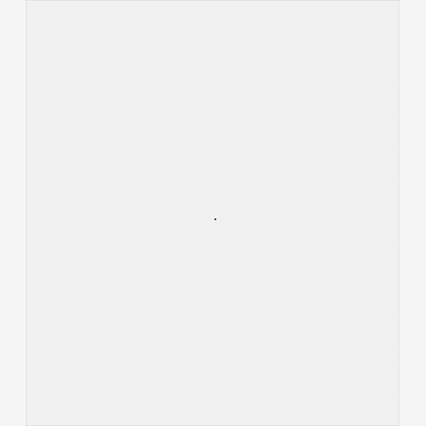
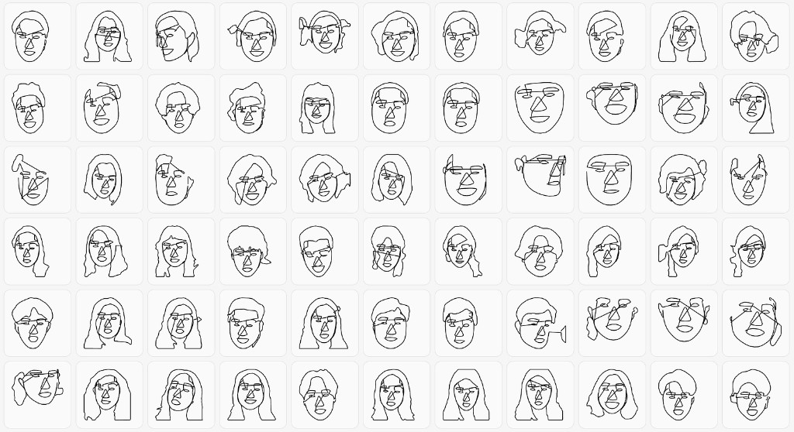

# BioGlyph

**One line. Your face. Nothing else.**

[](https://bio.bairui.dev/)
[](https://itp.nyu.edu/shows/spring2026/)



BioGlyph is an interactive web app that turns your face into a single continuous line — a personal signature drawn from your own features, not a filter.

Built in six hours for the [ITP Spring Show 2026](https://itp.nyu.edu/shows/spring2026/), it was tried by **150+ people** who collectively archived **428 faces**. Friends gathered around the screen, watched their portraits emerge from nothing, and took home something uniquely theirs.

**You are welcome here.** Open the [live app](https://bio.bairui.dev/), point your camera, and watch your one-line portrait appear. When you like it, press **Add to Archive** — your face joins the online gallery at the top of the [archive](https://bio.bairui.dev/archive), alongside the ITP Spring Show collection. Hover your portrait (marked with `*`) to delete it anytime.



> *Simple things still matter.*

[**Try it live →**](https://bio.bairui.dev/) · [**Explore the archive →**](https://bio.bairui.dev/archive) · [**Read the story →**](https://medium.com/@subairui/my-last-itp-spring-show-bioglyph-simple-things-still-matter-c27ab28d218d)

## What it does

1. **Capture** — Point your webcam at the screen.
2. **Extract** — MediaPipe detects facial landmarks; image segmentation pulls out hair, ears, and contours.
3. **Connect** — Features are ordered to minimize line overlap and merged into one path.
4. **Reveal** — A Fourier-series animation progressively reconstructs the drawing, inspired by [Mike Bostock's Fourier Series — Progressive](https://observablehq.com/@mbostock/fourier-series-progressive).
5. **Keep** — Download PNG or SVG, replay the animation, or press **Add to Archive** to share your portrait online.
6. **Browse** — The [archive](https://bio.bairui.dev/archive) lists community faces first, then 428 portraits from ITP Spring Show 2026.

Up to **four faces** can be detected at once — couples, friends, whole groups — each merged left to right into a shared one-line portrait.


## Why it exists

BioGlyph explores facial features as a form of personal signature and identity through generative art. It asks a quiet question: after abstraction and sketching, what still makes a face *yours*?

The project grew out of earlier experiments — a Progressive Self Portrait using Fourier series, abandoned ideas around name-to-face procedural generation, and a digital penPal that never quite clicked. What worked was the simplest thing: point a camera, watch a line appear, feel something.

## How it works

```
Webcam / image
      │
      ▼
┌─────────────────────────────────────┐
│  MediaPipe Face Landmarker          │  eyes, nose, lips, face oval
│  MediaPipe Image Segmenter          │  hair, ears (multiclass mask)
└─────────────────────────────────────┘
      │
      ▼
┌─────────────────────────────────────┐
│  Contour extraction + ordering      │  minimize overlaps, merge multi-face
│  buildOneLinePath()                 │  lips → nose → eyes → hair → jaw …
└─────────────────────────────────────┘
      │
      ▼
┌─────────────────────────────────────┐
│  Fourier progressive reconstruction │  epicycle animation on canvas
│  Export PNG / SVG · Add to Archive  │
└─────────────────────────────────────┘
      │
      ├─ Community ──► Supabase `faces` (browser ID, delete own)
      └─ Show archive ─► itp-spring-show-2026.json (428 portraits)
```

**Face pipeline** (`src/facePipeline.js`) — landmark-based feature outlines, segmentation-backed hair and ear contours, Ramer–Douglas–Peucker simplification, and greedy path ordering so the stroke reads cleanly as one line.

**Animation** (`src/fourierOneLineAnimation.js`) — resamples the path, computes DFT coefficients, and animates progressive reconstruction with adjustable epicycle count.

**Archive** (`/archive`, `/face/:id`) — **Community** portraits from Supabase (`faces` table, newest first), then **ITP Spring Show 2026** from bundled JSON; each entry has a shareable URL and downloadable assets.

A companion Jupyter notebook (`python/bio_glyph_face_pipeline.ipynb`) mirrors the extraction logic for offline experimentation.

## Tech stack

| Layer | Tools |
|-------|-------|
| UI | React 19, React Router 7, Vite 8, [Lucide](https://lucide.dev/) icons |
| Vision | [MediaPipe Tasks Vision](https://ai.google.dev/edge/mediapipe/solutions/vision/face_landmarker) — Face Landmarker + Selfie Multiclass Segmenter (CDN WASM) |
| Animation | Custom Fourier-series renderer (Canvas 2D) |
| Community archive | [Supabase](https://supabase.com/) — Postgres `faces` table, `@supabase/supabase-js`, Row Level Security; shared [`bairui-studio`](https://supabase.com/) project with [Name2Tree](https://tree.bairui.dev/) (`trees` table) |
| Deploy | Vercel (`bio-glyph`) |

All face **processing** runs in the browser — no server-side vision, no API keys for MediaPipe.

**Community archive** uses the Supabase **anon** publishable key in the client (`VITE_SUPABASE_URL`, `VITE_SUPABASE_ANON_KEY`). A stable `bioglyph_browser_id` in `localStorage` ties each submission to your device so you can delete only your own portraits.

## Getting started

**Requirements:** Node.js 18+

```bash
git clone https://github.com/pearmini/bio-glyph.git
cd bio-glyph
npm install
cp .env.example .env.local   # optional: enable Add to Archive
npm run dev
```

Open [http://localhost:5173](http://localhost:5173). Allow camera access when prompted.

### Supabase setup (community archive)

1. Run [`supabase/faces.sql`](supabase/faces.sql) in the Supabase SQL Editor (`bairui-studio`).
2. Set `VITE_SUPABASE_URL` and `VITE_SUPABASE_ANON_KEY` in `.env.local` and on Vercel (project `bio-glyph`).

```bash
npm run build    # production build
npm run preview  # preview production build locally
npm run lint     # ESLint
```

MediaPipe WASM and model files load from CDN on first use; a short delay on the first generation is normal.

## Project structure

```
bio-glyph/
├── src/
│   ├── App.jsx                 # Main capture + generation flow
│   ├── facePipeline.js         # MediaPipe extraction → one-line path
│   ├── fourierOneLineAnimation.js
│   ├── generationStorage.js    # Bundled archive data + SVG helpers
│   ├── lib/                    # Supabase client, faces API, validation
│   ├── ArchivePage.jsx         # Community + ITP 2026 gallery
│   ├── FacePage.jsx            # Individual portrait view
│   └── data/
│       └── itp-spring-show-2026.json
├── supabase/
│   └── faces.sql               # Schema + RLS for community faces
├── python/
│   └── bio_glyph_face_pipeline.ipynb
└── img/
    └── face.png
```

## Routes

| Path | Description |
|------|-------------|
| `/` | Create a new one-line portrait |
| `/archive` | **Community** (Supabase, if any), then **ITP Spring Show 2026** (bundled) |
| `/face/:id` | View, replay, and download a saved portrait |

## Credits

**Created by [Bairui Su](https://bairui.dev/)** — ITP, NYU

- Interaction design & visual prototyping with **Jin**
- Inspired by [Mike Bostock](https://bost.ocks.org/mike/)'s Fourier explorations and an earlier Progressive Self Portrait experiment
- Built with help from [Cursor](https://cursor.com/) and prior face-line experiments

**Show feedback that shaped the project:**
- *"Why do all the faces look so similar?"* — landmark geometry is a known limit; contour-based extraction is the next step
- *"Can multiple people try it together?"* — added after day one; up to four faces merge into one path
- *"It's nice to see face-detection used to create something, not just apply filters."* — exactly the point

## License

[MIT](./LICENSE) © 2026 Bairui Su

<p align="center">
  <a href="https://bio.bairui.dev/"><strong>bio.bairui.dev</strong></a>
  &nbsp;·&nbsp;
  <a href="https://github.com/pearmini/bio-glyph">Source</a>
  &nbsp;·&nbsp;
  <a href="https://bairui.dev/">Blog</a>
</p>

<p align="center"><em>Simple things still matter.</em></p>
